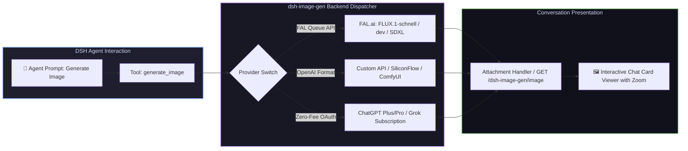

# 📦 @goodandready/dsh-image-gen

<div align="center">

<h3>Native Image Generation Tool with FAL Queue, OpenAI APIs, and Subscription Backends</h3>

<p align="center">
  <a href="https://www.npmjs.com/package/@goodandready/dsh-image-gen"></a>
  <a href="LICENSE"></a>
  <a href="https://github.com/topics/dsh-plugin"></a>
  <a href="https://nodejs.org"></a>
</p>

<p align="center">
  <a href="README.md"><b>🇬🇧 English</b></a> •
  <a href="README.ru.md"><b>🇷🇺 Русский</b></a> •
  <a href="README.zh.md"><b>🇨🇳 中文说明</b></a>
</p>

</div>

---

## ⚡ Overview

**`dsh-image-gen`** gives your **DeepSeek Harness** agent a versatile `generate_image` tool and renders generated artwork directly where it belongs — inside the chat conversation with zoom, parameter inspection, and one-click download.



---

## 🎨 Supported Generation Backends

| Provider | Backend Service | Credential Requirement | Description & Models |
|---|---|---|---|
| `fal` (default) | [FAL.ai](https://fal.ai) Queue | `FAL_API_KEY` | Ultra-fast queue inference (`fal-ai/flux-2/klein/9b`, `FLUX.1-schnell`, `SDXL`) |
| `custom` | OpenAI-compatible Image API | `OPENAI_API_KEY` (or custom) | Connect DALL-E 3, SiliconFlow, Together, or local ComfyUI/Automatic1111 |
| `codex` | ChatGPT Subscription (`gpt-image-2`) | *None (OAuth)* | Uses connected ChatGPT account in `dsh-subscriptions` without API fees |
| `grok` | Grok Subscription (`grok-imagine-image-2.0`) | *None (OAuth)* | Uses connected Grok account in `dsh-subscriptions` without API fees |

---

## 📦 Delivery Modes: `link` vs `image`

| Feature Comparison | `link` Mode (Default) | `image` Mode |
|---|---|---|
| **What the chat model receives** | Text and an attachment link | Raw image binary payload |
| **Rendered in Web UI** | Yes, full-width interactive card | Yes |
| **Works with text-only chat models** | **Yes, fully standalone** | Requires [`dsh-vision-bridge`](https://github.com/GooDAnDReaDY/dsh-vision-bridge) |
| **Model can reason about the picture** | Based on prompt and link text | Full visual multimodal reasoning |
| **Storage link durability** | Permanent host route (`GET /image`) | Provider CDN (temporary expiry) |

---

## 🎮 Usage Example

Simply ask your agent:
> "Generate a photorealistic cyberpunk street in Tokyo during rain, neon lights reflections, 16:9"

### Tool Parameters

| Parameter | Type | Description |
|---|---|---|
| `prompt` | `string` (Required) | Detailed text description of the image to generate |
| `image_size` | `string` | `square_hd` (1024x1024), `landscape_4_3` (1024x768), `landscape_16_9`, `portrait_4_3`, `portrait_16_9` |
| `seed` | `number` | Random seed for deterministic reproducibility |
| `output_format` | `string` | `png` (default), `jpeg`, or `webp` |
| `output_name` | `string` | Custom filename without extension |

---

## 📦 Quick Installation

```bash
dsh plugin --profile web add @goodandready/dsh-image-gen
```

---

## ⚙️ Configuration Reference (**Settings → Image generation**)

```yaml
dsh-image-gen:
  provider: fal
  model: fal-ai/flux-2/klein/9b
  apiKeyEnv: FAL_API_KEY
  defaultSize: landscape_4_3
  defaultFormat: png
  pollIntervalMs: 2000
  timeoutMs: 180000
  deliverAs: link
  outputDir: generated/images
```

| Parameter | Default | Description |
|---|---|---|
| `provider` | `fal` | Active drawing provider: `fal`, `custom`, `codex`, `grok` |
| `model` | `fal-ai/flux-2/klein/9b` | Model identifier for FAL or custom endpoints |
| `apiKeyEnv` | `FAL_API_KEY` | Credential reference name for API key |
| `baseURL` | `https://queue.fal.run` | FAL queue endpoint root |
| `defaultSize` | `landscape_4_3` | Default size if omitted in tool call |
| `defaultFormat` | `png` | Image format: `png`, `jpeg`, `webp` |
| `deliverAs` | `link` | Delivery mode: `link` (universal) or `image` (multimodal) |
| `customBaseURL` | — | Root URL for OpenAI-compatible endpoint |
| `customModel` | — | Model ID for custom provider (e.g. `dall-e-3`) |
| `customKeyEnv` | `OPENAI_API_KEY` | Credential reference for custom API key |
| `outputDir` | `generated/images` | Storage folder for saved image files |

---

## 🔄 Upgrading from `dsh-fal-image-gen`

Installing `@goodandready/dsh-image-gen` automatically migrates your previous configuration namespace, and legacy image links in past conversations remain fully visible without breaking.

---

## 📄 License

MIT © [GooDAnDReaDY](https://github.com/GooDAnDReaDY)
