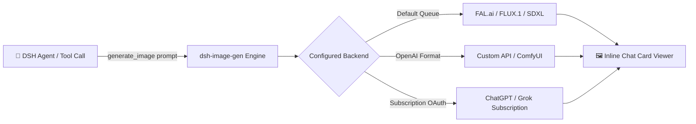

# 📦 @goodandready/dsh-image-gen

<div align="center">

<h3>Native Image Generation Tool with FAL Queue, OpenAI APIs, and Subscription Backends</h3>

<p align="center">
  <a href="https://www.npmjs.com/package/@goodandready/dsh-image-gen"></a>
  <a href="LICENSE"></a>
  <a href="https://github.com/topics/dsh-plugin"></a>
  <a href="https://nodejs.org"></a>
</p>

<p align="center">
  <a href="README.md"><b>🇬🇧 English</b></a> •
  <a href="README.ru.md"><b>🇷🇺 Русский</b></a> •
  <a href="README.zh.md"><b>🇨🇳 中文说明</b></a>
</p>

</div>

---

## ⚡ Overview

**`dsh-image-gen`** equips your **DeepSeek Harness** agent with a versatile `generate_image` tool, rendering generated artwork directly in the conversation with zoom, parameter inspect, and instant download.



---

## ✨ Key Features

* 🎨 **Multi-Backend Architecture**: Supports FAL Queue API, OpenAI-compatible image endpoints (DALL-E 3, SiliconFlow, Together), and ChatGPT/Grok OAuth subscriptions (via `dsh-subscriptions`).
* 🖼️ **Dedicated Tool Card Viewer**: Renders generated images with full-width responsive preview, lightbox zoom, and one-click download.
* 📦 **Flexible Delivery Modes**: Choose `link` (universal for text-only models) or `image` (for multimodal reasoning with `dsh-vision-bridge`).
* 🔒 **Subscription Support**: Leverage ChatGPT Plus/Pro or Grok subscriptions without paying per-image API costs.

---

## 📦 Quick Installation

```bash
dsh plugin --profile web add @goodandready/dsh-image-gen
```

---

## 📄 License

MIT © [GooDAnDReaDY](https://github.com/GooDAnDReaDY)
