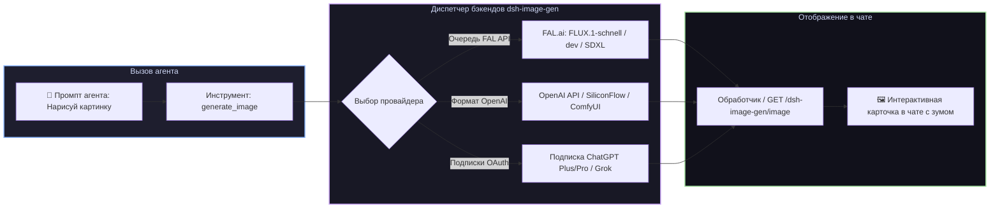

# 📦 @goodandready/dsh-image-gen

<div align="center">

<h3>Инструмент генерации изображений через FAL Queue, OpenAI API и личные подписки</h3>

<p align="center">
  <a href="https://www.npmjs.com/package/@goodandready/dsh-image-gen"></a>
  <a href="LICENSE"></a>
  <a href="https://github.com/topics/dsh-plugin"></a>
  <a href="https://nodejs.org"></a>
</p>

<p align="center">
  <a href="README.md"><b>🇬🇧 English</b></a> •
  <a href="README.ru.md"><b>🇷🇺 Русский</b></a> •
  <a href="README.zh.md"><b>🇨🇳 中文说明</b></a>
</p>

</div>

---

## ⚡ Обзор

**`dsh-image-gen`** предоставляет агенту **DeepSeek Harness** инструмент `generate_image` и отображает результат генерации прямо в окне диалога с возможностью зума, просмотра параметров и скачивания в 1 клик.



---

## 🎨 Поддерживаемые бэкенды генерации

| Провайдер | Бэкенд | Учётные данные | Описание и модели |
|---|---|---|---|
| `fal` (дефолт) | [FAL.ai](https://fal.ai) Queue | `FAL_API_KEY` | Сверхбыстрая генерация (`fal-ai/flux-2/klein/9b`, `FLUX.1-schnell`, `SDXL`) |
| `custom` | OpenAI-совместимый API | `OPENAI_API_KEY` | Подключение DALL-E 3, SiliconFlow, Together или локального ComfyUI |
| `codex` | Подписка ChatGPT (`gpt-image-2`) | *Без ключа (OAuth)* | Использование аккаунта ChatGPT из `dsh-subscriptions` без платы за API |
| `grok` | Подписка Grok (`grok-imagine-image-2.0`) | *Без ключа (OAuth)* | Использование аккаунта Grok из `dsh-subscriptions` без платы за API |

---

## 📦 Режимы доставки: `link` или `image`

| Сравнение | Режим `link` (По умолчанию) | Режим `image` |
|---|---|---|
| **Что получает модель чата** | Текст и ссылку на файл | Бинарные данные картинки |
| **Отображение в Web UI** | Да, интерактивная карточка | Да |
| **Работа с текстовыми LLM** | **Да, полностью самостоятельно** | Требуется [`dsh-vision-bridge`](https://github.com/GooDAnDReaDY/dsh-vision-bridge) |
| **Анализ картинки моделью** | По тексту промпта и ссылке | Полноценный визуальный анализ |
| **Долговечность ссылки** | Постоянный роут хоста (`GET /image`) | CDN провайдера (срок жизни ограничен) |

---

## 🎮 Пример использования

Просто попросите агента:
> "Сгенерируй фотореалистичную улицу Токио ночью в стиле киберпанк под дождём, неоновые отражения, 16:9"

### Параметры инструмента

| Параметр | Тип | Описание |
|---|---|---|
| `prompt` | `string` (Обязательный) | Детальное текстовое описание генерируемого изображения |
| `image_size` | `string` | `square_hd` (1024x1024), `landscape_4_3` (1024x768), `landscape_16_9`, `portrait_4_3`, `portrait_16_9` |
| `seed` | `number` | Сид для воспроизводимости результата |
| `output_format` | `string` | `png` (по умолчанию), `jpeg` или `webp` |
| `output_name` | `string` | Пользовательское имя файла без расширения |

---

## 📦 Быстрая установка

```bash
dsh plugin --profile web add @goodandready/dsh-image-gen
```

---

## ⚙️ Настройки в Web GUI (**Настройки → Генерация изображений**)

```yaml
dsh-image-gen:
  provider: fal
  model: fal-ai/flux-2/klein/9b
  apiKeyEnv: FAL_API_KEY
  defaultSize: landscape_4_3
  defaultFormat: png
  pollIntervalMs: 2000
  timeoutMs: 180000
  deliverAs: link
  outputDir: generated/images
```

---

## 🔄 Миграция с `dsh-fal-image-gen`

Установка `@goodandready/dsh-image-gen` автоматически подхватывает настройки из пространства `dsh-fal-image-gen`, а все ранее сгенерированные изображения в старых сессиях продолжают корректно отображаться.

---

## 📄 Лицензия

MIT © [GooDAnDReaDY](https://github.com/GooDAnDReaDY)
