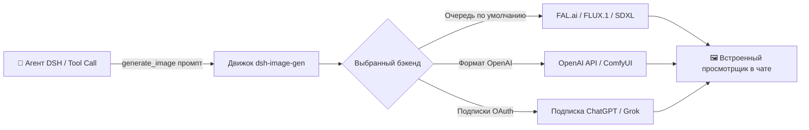

# 📦 @goodandready/dsh-image-gen

<div align="center">

<h3>Инструмент генерации изображений через FAL Queue, OpenAI API и личные подписки</h3>

<p align="center">
  <a href="https://www.npmjs.com/package/@goodandready/dsh-image-gen"></a>
  <a href="LICENSE"></a>
  <a href="https://github.com/topics/dsh-plugin"></a>
  <a href="https://nodejs.org"></a>
</p>

<p align="center">
  <a href="README.md"><b>🇬🇧 English</b></a> •
  <a href="README.ru.md"><b>🇷🇺 Русский</b></a> •
  <a href="README.zh.md"><b>🇨🇳 中文说明</b></a>
</p>

</div>

---

## ⚡ Обзор

**`dsh-image-gen`** предоставляет агенту **DeepSeek Harness** инструмент `generate_image`, отображая сгенерированные изображения прямо в окне диалога с возможностью зума и скачивания.



---

## ✨ Ключевые возможности

* 🎨 **Мультибэкенд архитектура**: поддержка FAL Queue, OpenAI-совместимых эндпоинтов и генерации через подписки ChatGPT/Grok (через `dsh-subscriptions`).
* 🖼️ **Интерактивный просмотрщик**: рендеринг картинок в чате с зумом и быстрым сохранением.
* 📦 **Два режима доставки**: `link` (работает с любыми текстовыми моделями) и `image` (для мультимодального анализа).

---

## 📦 Быстрая установка

```bash
dsh plugin --profile web add @goodandready/dsh-image-gen
```

---

## 📄 Лицензия

MIT © [GooDAnDReaDY](https://github.com/GooDAnDReaDY)
