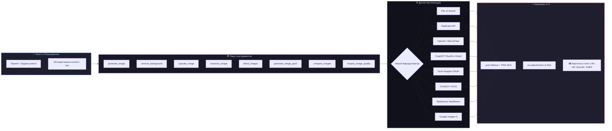

# 📦 @goodandready/dsh-image-gen

<div align="center">

<h3>Комплексный графический комбайн и генератор изображений для DeepSeek Harness</h3>

<p align="center">
  <a href="https://www.npmjs.com/package/@goodandready/dsh-image-gen"></a>
  <a href="LICENSE"></a>
  <a href="https://github.com/topics/dsh-plugin"></a>
  <a href="https://nodejs.org"></a>
</p>

<p align="center">
  <a href="https://goodandready.app/"></a>
</p>

<p align="center">
  <a href="README.md"><b>🇬🇧 English</b></a> •
  <a href="README.ru.md"><b>🇷🇺 Русский</b></a> •
  <a href="README.zh.md"><b>🇨🇳 中文说明</b></a>
</p>

</div>

---

## ⚡ Обзор возможностей

**`@goodandready/dsh-image-gen`** — флагманский графический плагин для экосистемы DeepSeek Harness, превращающий агента в полноценную творческую студию. Плагин предоставляет богатый набор инструментов для генерации, трансформации, апскейла, векторизации и анализа изображений с поддержкой 8 провайдеров генерации и интерактивной карточкой в чате.



---

## 🛠️ Полный реестр инструментов

| Инструмент | Назначение | Ключевые параметры |
|---|---|---|
| **`generate_image`** | Генерация изображения по тексту | `prompt`, `image_size`, `seed`, `style`, `negative_prompt`, `count` |
| **`remove_background`** | Удаление фона с сохранением прозрачного PNG | `image`, `model`, `output_name` |
| **`upscale_image`** | Увеличение разрешения в 2x / 4x с детализацией | `image`, `scale` (2/4), `prompt`, `creativity` |
| **`vectorize_image`** | Векторизация растра в чистый SVG | `image`, `color_mode` (`color`/`binary`) |
| **`blend_images`** | Смешивание нескольких изображений в единую композицию | `images`, `weights`, `prompt` |
| **`generate_image_pack`** | Пакетный рендеринг форматов 1:1, 16:9, 9:16 под соцсети | `prompt`, `aspect_ratios` |
| **`compare_images`** | Сравнение двух картинок (доля различий пикселей) | `image_a`, `image_b` |
| **`inspect_image_quality`** | Аудит качества и артефактов генерации | `image`, `expected_elements` |

---

## 🎨 Поддерживаемые провайдеры генерации

| Провайдер | Бэкенд | Ключи / Доступ | Назначение и особенности |
|---|---|---|---|
| **`fal`** *(дефолт)* | FAL.ai Queue | `FAL_API_KEY` | Сверхбыстрая генерация (`FLUX.1-schnell`, `FLUX-dev`, `SDXL`), Upscaler, BiRefNet |
| **`replicate`** | Replicate API | `REPLICATE_API_TOKEN` | Модели сообщества (`black-forest-labs/flux-schnell`, `stability-ai/sdxl`) |
| **`custom`** | OpenAI-совместимый эндпоинт | `OPENAI_API_KEY` | DALL-E 3, SiliconFlow, Together AI, локальный OpenAI шлюз |
| **`codex`** | ChatGPT Plus/Pro | *Без ключа (OAuth)* | Использование учетной записи из `dsh-subscriptions` без тарификации API |
| **`grok`** | Grok Imagine | *Без ключа (OAuth)* | Использование учетной записи Grok из `dsh-subscriptions` без тарификации API |
| **`local`** | Локальный сервер | *Не требуется* | ComfyUI (граф нод / prompt queue) или Automatic1111 (txt2img/img2img) |
| **`seedream`** | ByteDance Doubao / SeaDream | `SEEDREAM_API_KEY` | Азиатские фотореалистичные генеративные модели |
| **`gemini`** | Google GenAI API | `GEMINI_API_KEY` | Imagen 3 через официальный Gemini API |

---

## 🎭 Библиотека стилей (`style_presets`)

Плагин содержит встроенные профили стилизации:
* **`cinematic`**: Кинематографичный кадр, 35mm оптика, естественный свет и глубина резкости.
* **`anime`**: Аниме-эстетика в стиле Макото Синкая, сочные цвета, тонкий лайн-арт.
* **`isometric`**: Изометрический 3D-рендер, пластилиновый стиль, мягкий студийный свет.
* **`cyberpunk`**: Киберпанк, неоновые отражения, объемный туман, ночная атмосфера.
* **`pixel_art`**: 16-битный ретро пиксель-арт, четкие контуры, дизеринг.
* **`oil_painting`**: Классическая масляная живопись, фактура холста, пастозные мазки.
* **`minimalist`**: Минималистичный плоский вектор, чистые линии, строгая геометрия.

---

## 🖼️ Интерактивная карточка в чате

Встроенный слот Web UI (`tool.call.toolview`) обеспечивает:
* **Кнопки быстрых действий**:
  * 🔄 **Re-roll**: повторная генерация со следующим сидом;
  * 🔍 **2x Upscale**: быстрый вызов инструмента увеличения разрешения;
  * ✂️ **Remove BG**: вырезание фона в прозрачный PNG;
  * 📋 **Копирование промпта и сида** в буфер обмена в один клик.
* **Вшивание метаданных**: параметры генерации (промпт, сид, модель) автоматически внедряются в `tEXt` чанки PNG-файлов.
* **Sidecar JSON**: для каждого файла создается `.json` файл с полными параметрами генерации, стоимостью и таймстемпом.

---

## 📦 Быстрая установка

```bash
dsh plugin --profile web add @goodandready/dsh-image-gen
```

---

## ⚙️ Пример конфигурации (`settings.yaml`)

```yaml
dsh-image-gen:
  provider: fal                          # fal | replicate | custom | codex | grok | local | seedream | gemini
  model: fal-ai/flux-2/klein/9b          # Идентификатор модели по умолчанию
  apiKeyEnv: FAL_API_KEY                 # Переменная окружения для ключа
  defaultSize: landscape_4_3             # square_hd | landscape_4_3 | landscape_16_9 | portrait_4_3 | portrait_16_9
  defaultFormat: png                     # png | jpeg | webp
  replicateModel: black-forest-labs/flux-schnell
  replicateKeyEnv: REPLICATE_API_TOKEN
  outputDir: generated/images            # Каталог сохранения готовых изображений
```

---

## 📄 Лицензия

MIT © [GooDAnDReaDY](https://github.com/GooDAnDReaDY)